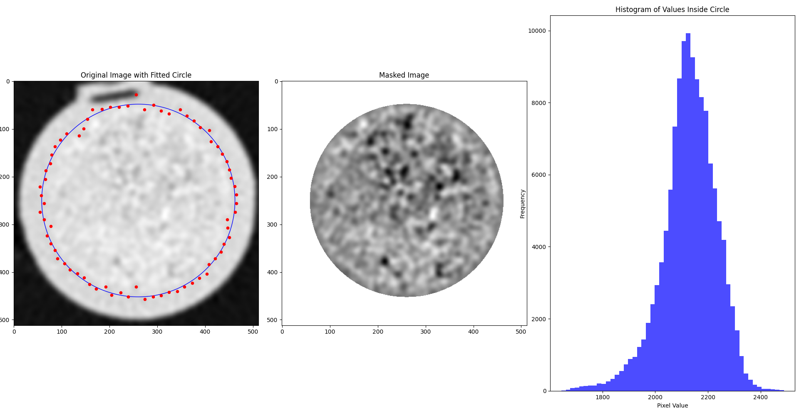

# Circular Mask

A Python tool for automatically detecting and masking circular regions in
medical CT core sample images.

## Overview

This tool provides functionality to:
1. Process 3D core sample data stored in binary format
2. Automatically detect circular boundaries using wavelet transformation
3. Generate precise circular masks for each slice
4. Visualize results with fitted circles and histograms



## Features

- Automatic circle detection using wavelet transformation
- Robust boundary detection through multi-angle analysis
- Support for 3D core data processing
- Visualization tools for results analysis
- Progress tracking for batch processing

## Dependencies

Requires Python 3.12 or higher and the `uv` project manager.

- matplotlib >= 3.10.0
- numpy >= 2.2.2
- PyQt5 >= 5.15.11
- PyWavelets >= 1.8.0
- scipy >= 1.15.1
- tqdm >= 4.67.1

```bash
# Clone the repository
git clone https://github.com/Labore-Unicamp/circular-mask
cd circular-mask

# Install dependencies
uv venv
source .venv/bin/activate
```
## Usage

### Processing Core Data

```bash
# Process a core data file to generate masks
uv run process_core.py --input path/to/core.raw
```

This will generate a mask file with the suffix '_mask.raw'.

### Visualizing Results

```bash
# Visualize results for a specific slice
uv run plot_results.py --input path/to/core.raw --slice-index 100
```

This will display:
1. Original image with the fitted circle
2. Masked image
3. Histogram of values inside the circle

## Technical Details

The masking process involves looking at profiles of radii (line segments
crossing the center of the slices) on several angles, aiming to cover the whole
core circumference. These profiles have their peaks, points of inflection and
points of frequency regime changes detected through a Wavelet transformation.
Once these points are determined, we keep only the second and second to last of
them, given that these are the points that indicate the transition between the
rubber shirt that holds the core sample and the core sample itself on both ends.

These two points are detected on several angles of rotation covering the whole
core circumference. The collection of obtained points is used, then, to fit a
circle shape through least squares. This circle determines the mask boundaries.


## Input Format

Expects raw binary files containing `int16` values, which will be reshaped to
(N, 512, 512) dimensions, where N is the number of slices.
